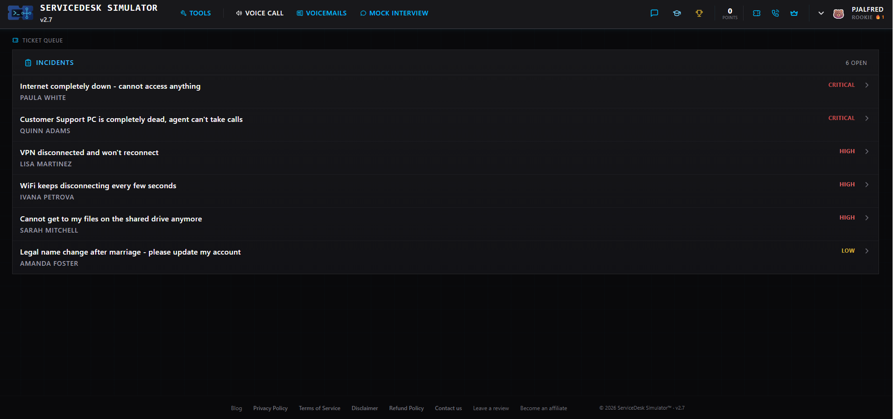
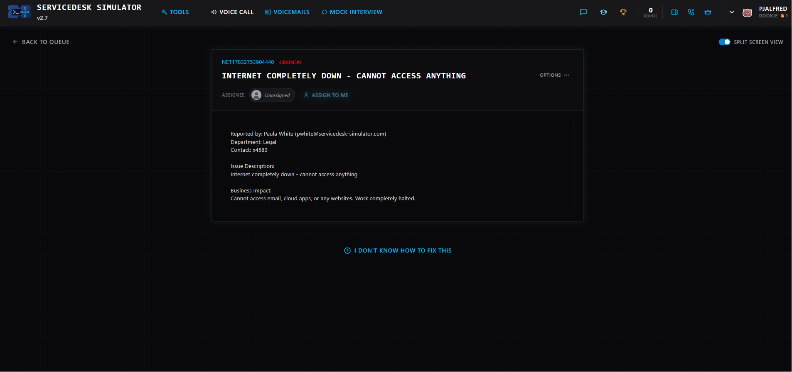
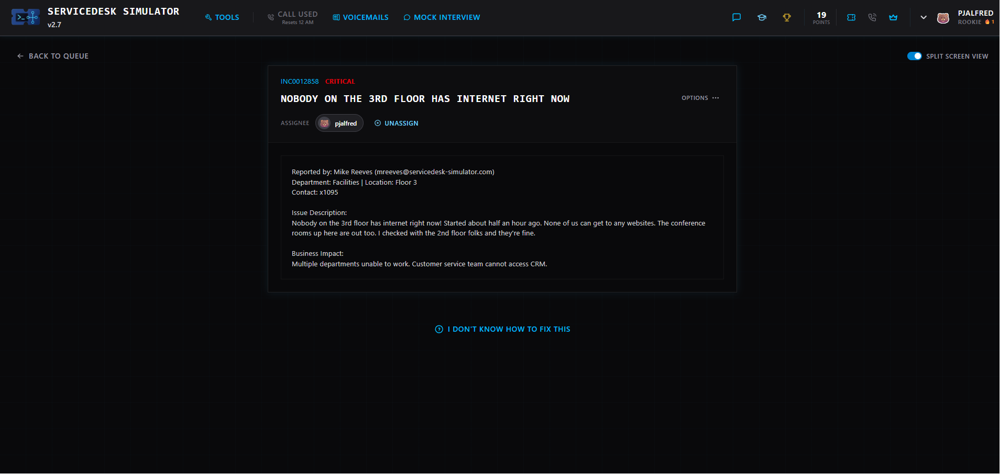
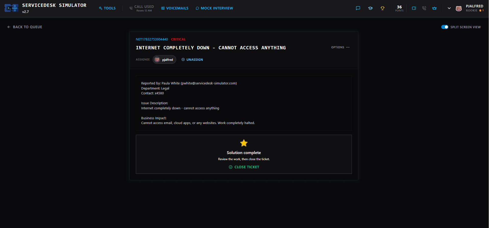
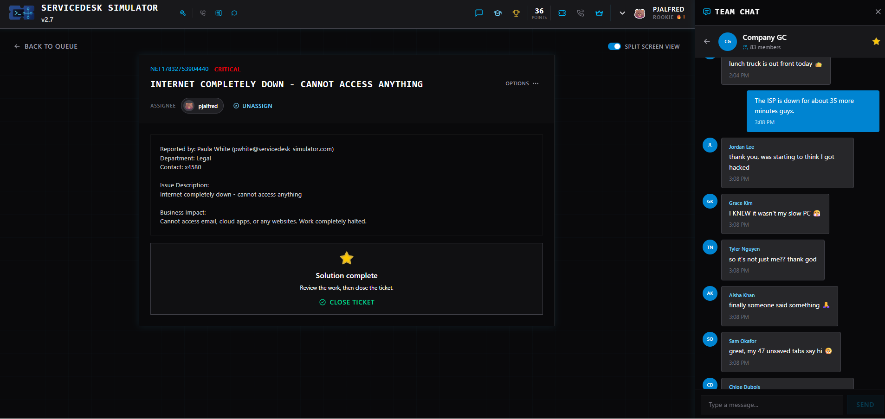
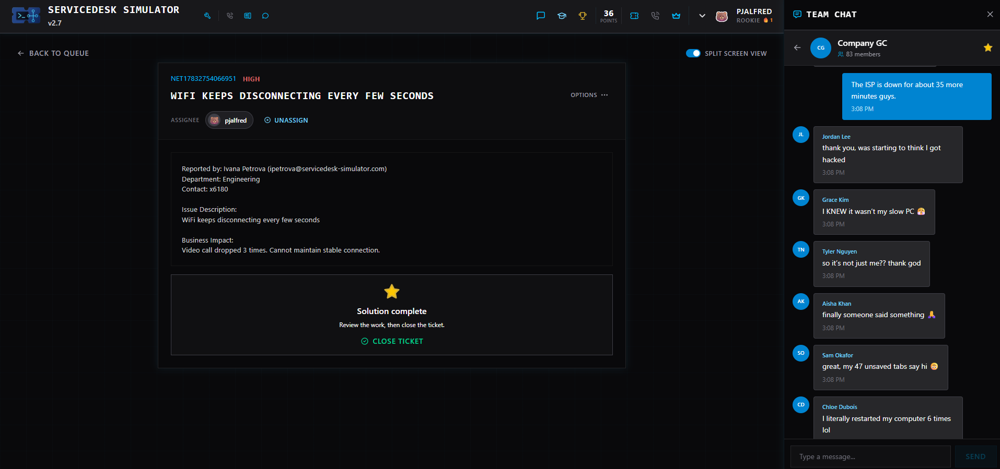
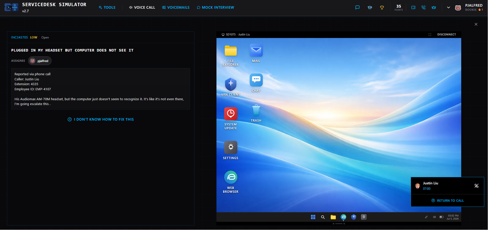
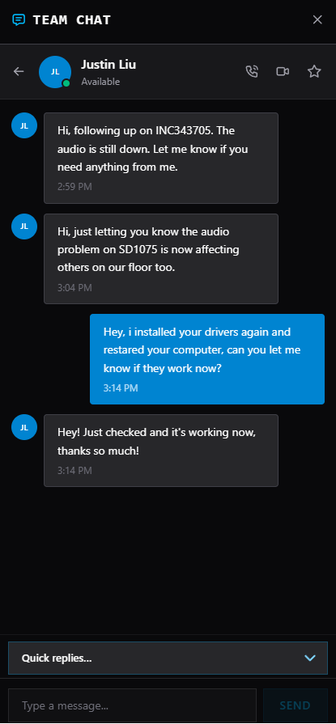
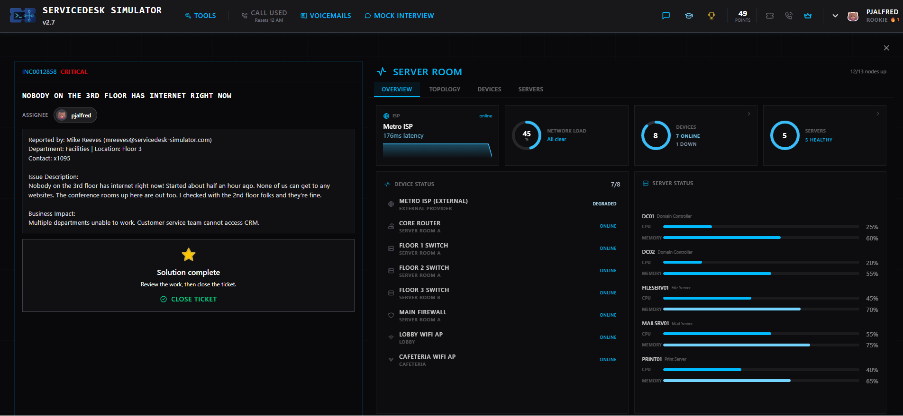

# 🎫 ServiceDesk Ticketing Simulator

**Tools:** ServiceDesk Simulator, Windows 11, Remote Desktop, Network Monitoring, Incident Management, IT Troubleshooting

This project demonstrates hands-on IT Help Desk experience through enterprise-style incident response scenarios completed in the ServiceDesk Simulator platform. The lab simulates a real corporate support environment where tickets are prioritized, investigated, resolved, documented, and verified before closure.

---

# Skills Demonstrated

- Incident Management
- IT Help Desk Operations
- Ticket Triage & Prioritization
- Remote Desktop Support
- Windows 11 Troubleshooting
- Network Troubleshooting
- Wi-Fi Troubleshooting
- Driver Troubleshooting
- User Communication
- Business Impact Assessment
- Root Cause Analysis
- Ticket Documentation
- Incident Verification
- Ticket Closure

---

# Technologies Used

- ServiceDesk Simulator
- Windows 11
- Remote Desktop
- Network Monitoring Dashboard
- Internal Team Chat
- Ticket Management System

---

# Scenario Overview

During this lab I worked through multiple real-world IT support incidents involving enterprise users and infrastructure. Each scenario required reviewing ticket information, determining business impact, investigating the issue, applying troubleshooting steps, communicating with users, and verifying successful resolution before closing the incident.

---

# 1. Ticket Queue Overview

The ticket queue contained multiple incidents ranging from Low to Critical severity. This required prioritizing work based on business impact and urgency just like an enterprise Help Desk environment.

---

# 2. Critical Internet Outage

A critical incident reported that internet connectivity was completely unavailable, preventing access to email, cloud applications, and websites. Because the outage affected business operations, this ticket became the highest priority.

**Objectives**

- Review incident details
- Assess business impact
- Begin investigation
- Assign ownership

---

# 3. Network Monitoring Investigation

The investigation continued using the infrastructure monitoring dashboard.

The dashboard provided visibility into:

- ISP status
- Network utilization
- Device health
- Switch status
- Firewall status
- Wireless Access Points
- Server health

Using this information, the issue was identified as an ISP outage rather than an internal hardware failure.

---

# 4. Internet Outage Resolution

Once service was restored, the incident was verified before closing the ticket.

This demonstrates proper incident management by ensuring the issue was fully resolved before completing the work order.

---

# 5. Team Communication During Major Incident

Throughout the outage, users were kept informed using the internal company communication platform.

Providing updates during major incidents is an important Help Desk responsibility because it reduces duplicate tickets and keeps employees informed.

---

# 6. Wi-Fi Connectivity Incident

A user reported intermittent Wi-Fi disconnections affecting video calls.

The issue required reviewing the incident details, investigating wireless connectivity, validating the fix, and closing the ticket after successful resolution.

---

# 7. Remote Desktop Troubleshooting

Another incident involved a headset that Windows failed to recognize.

Using the integrated remote desktop session, the workstation was accessed remotely to troubleshoot the issue.

Troubleshooting included:

- Reviewing the user's desktop
- Investigating device recognition
- Reinstalling drivers
- Restarting the computer
- Verifying device functionality

---

# 8. User Verification

After completing the repair, the user confirmed through chat that the headset was functioning correctly.

This final verification step is an important part of incident management before closing a ticket.

---

# 9. Floor-Wide Network Outage

A separate Critical incident involved an entire office floor losing internet connectivity while other floors remained online.

The incident required:

- Determining outage scope
- Reviewing affected locations
- Assessing business impact
- Investigating network infrastructure
- Escalating appropriately
- Verifying restoration

---

# Incident Response Workflow

For every ticket the following workflow was followed:

1. Review the incident
2. Determine severity
3. Assess business impact
4. Assign ownership
5. Investigate the issue
6. Perform troubleshooting
7. Verify the solution
8. Communicate with the user
9. Document actions taken
10. Close the incident

---

# Key Results

- Managed multiple simulated enterprise IT support incidents
- Prioritized incidents based on severity and business impact
- Investigated network infrastructure using monitoring dashboards
- Performed remote desktop troubleshooting
- Diagnosed endpoint hardware and driver issues
- Communicated outage updates with users
- Verified successful remediation before ticket closure
- Followed standard enterprise incident management workflows

---

# What I Learned

This lab provided practical experience with day-to-day IT Help Desk operations including ticket management, infrastructure troubleshooting, endpoint support, remote assistance, user communication, and incident resolution.

The scenarios closely mirror responsibilities commonly found in Help Desk, Desktop Support, Junior Systems Administrator, Technical Support, and Security Operations environments.
